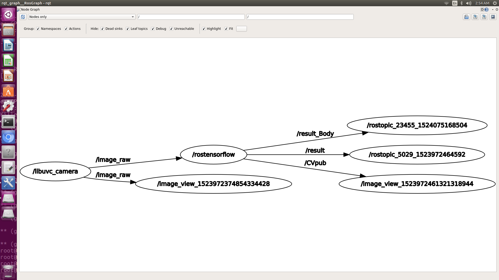
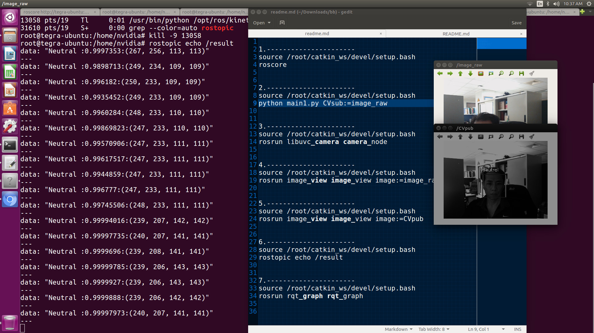
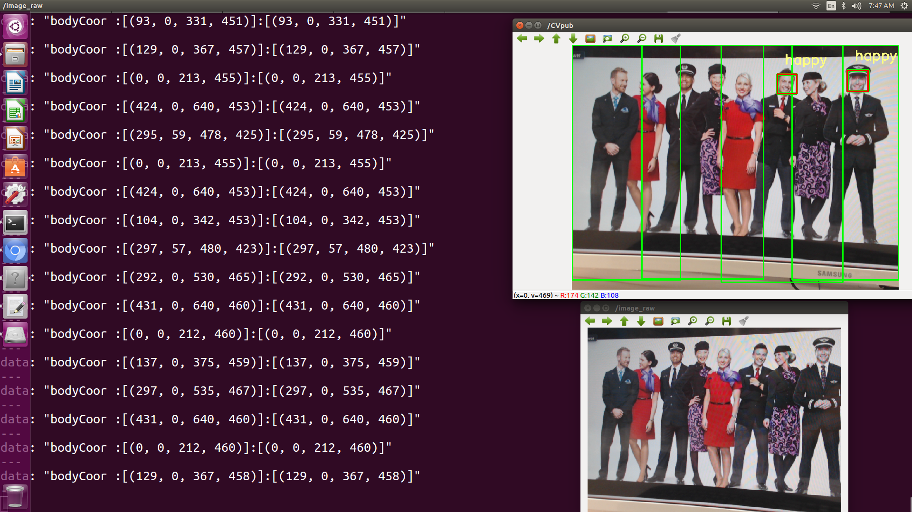
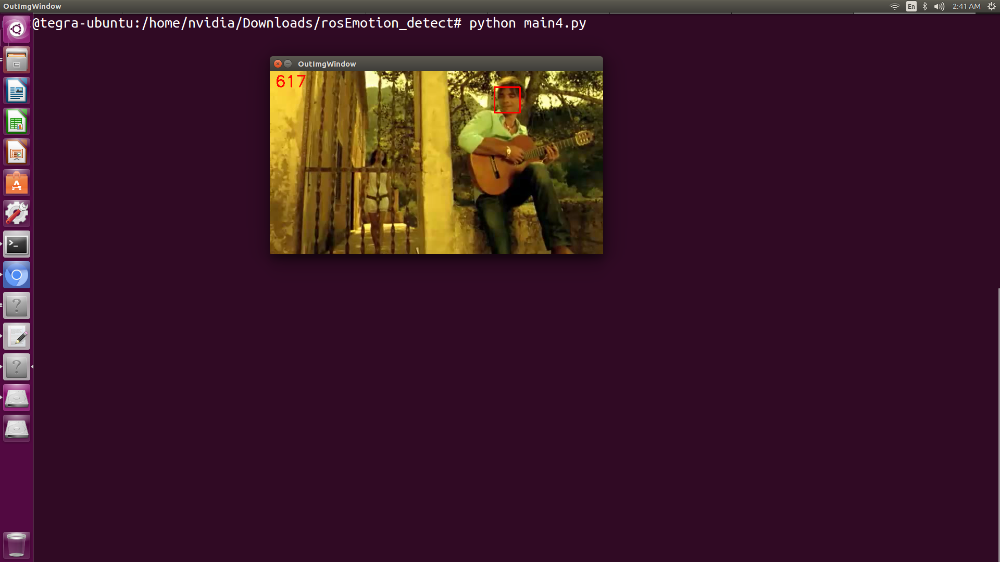

# Emotion recognition detecting at ROS Nvidia Tx2
This is the tensorflow slim model for emotion reconition

Ret1):  表情代號: 0:angry ,1:happy  ,2:neutral ,3:sad ,4:surprise

Ret2):  情緒百分比: %

Ret3):  臉部坐標:  (x, y, w, h) == (46, 202, 127, 127)

```bash
$ (表情,%百分比,臉部坐標[x,y,w,h] ) == (Happy,0.8253038,[46,202,127,127])
```

rosEmotion_detecting ....
=========================

- Install TensorFlow (see [tensor flow install guide](https://www.tensorflow.org/install/install_linux))
- Install ROS (see http://wiki.ros.org)
- InstallROSTX2 (see https://github.com/jetsonhacks/installROSTX2)
    - updateRepositories.sh
    - installROS.sh
    - setupCatkinWorkspace.sh
- Install cv-bridge

```bash
$ sudo apt-get install ros-kinetic-cv-bridge ros-kinetic-opencv3
```

- (Optional1) Install camera driver (for example, cv_camera , cv_camera_node)

```bash
$ sudo apt-get install ros-kinetic-cv-camera
```

- (Optional2) Install UVC Camera for ROS
```bash
$ sudo apt-get install ros-kinetic-libuvc-camera
$ sudo apt-get install ros-kinetic-image-pipeline
$ rosdep update
```

- (Optional3) Create udev rule
    - /etc/udev/rules.d/99-uvc.rules
```bash
$ SUBSYSTEM=="usb", ATTR{idVendor}=="046d", MODE="0666"
```

- (Optional4) Test Camera
```bash
$ rosrun libuvc_camera camera_node
$ rosrun image_view image_view image:=image_raw
```

TensorFlow install note (without GPU)
-------------------------------------------
Please read official guide. This is a only note for me.

```bash
$ sudo apt-get install python-pip python-dev python-virtualenv
$ virtualenv --system-site-packages ~/tensorflow
$ source ~/tensorflow/bin/activate
$ pip install --upgrade tensorflow
```


TensorFlow install note (with GPU)
-------------------------------------------
Please read official guide. This is a only note for me.

```bash
$ sudo apt-get install python-pip python-dev python-virtualenv
$ virtualenv --system-site-packages ~/tensorflow
$ source ~/tensorflow/bin/activate
$ pip install --upgrade tensorflow-1.4.1-cp27-cp27mu-linux_aarch64.whl
$ https://github.com/peterlee0127/tensorflow-nvJetson
$ https://github.com/jetsonhacks/installTensorFlowTX2
```


rosEmotion_detect.py
--------------------
* subscribe: /CVsub  (sensor_msgs/Image)
* publish:   /CVpub  (sensor_msgs/Image)
* publish1:  /result (std_msgs/String)


# Environmental requirements
Opencv 3.2 or laster

Tensorflow 1.4.1

# Training variable
train_image_size=160 

max_number_of_steps=60000 

Pre-trained Models=resnet_v2_50

# Start up
How to try

```bash
old version
***
$ source /root/catkin_ws/devel/setup.bash
$ roscore
$ rosrun libuvc_camera camera_node
$ rosrun image_view image_view image:=image_raw
$ rosrun image_view image_view image:=CVpub
$ rostopic echo /result
$ rosrun rqt_graph rqt_graph
$ source ~/tensorflow/bin/activate
$ python main1.py CVsub:=image_raw
```

```
new version
***
$ cd /root/catkin_ws/
$ catkin_make 
$ source /root/catkin_ws/devel/setup.bash
$ roscore
$ roslaunch usb_cam usb_cam-test.launch
$ rosrun rosEmotion_detect listen.py CVsub1:=/usb_cam/image_raw
```

# Log
```
cat result.log
```

# Function Input & Output

See main1.py


```
#Program execution
python main1.py CVsub:=image_raw

#function output
(表情,%百分比,臉部坐標[x,y,w,h] ) == (Happy,0.8253038,[46,202,127,127])
```

See main.py

```
#function input
expr_list = r.classify_image(frame, bbox_list)

#function output
#[(2, 0.93376148), (2, 0.98358649), (1, 0.98518467), (2, 0.9335444), (0, 0.7758944)]
print(fexpr_list)
```


# Demo








