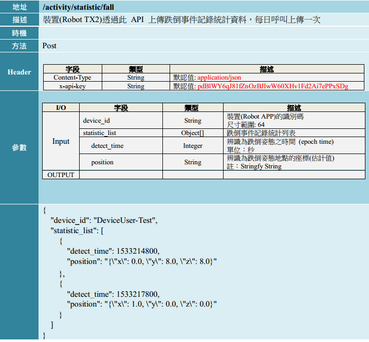
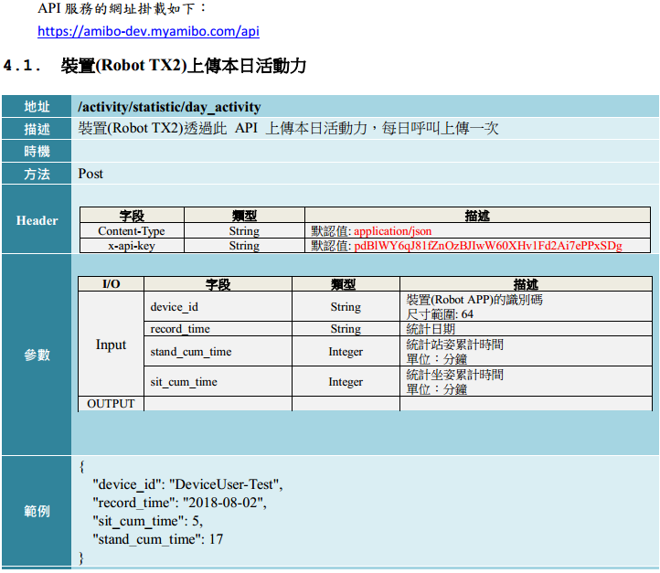
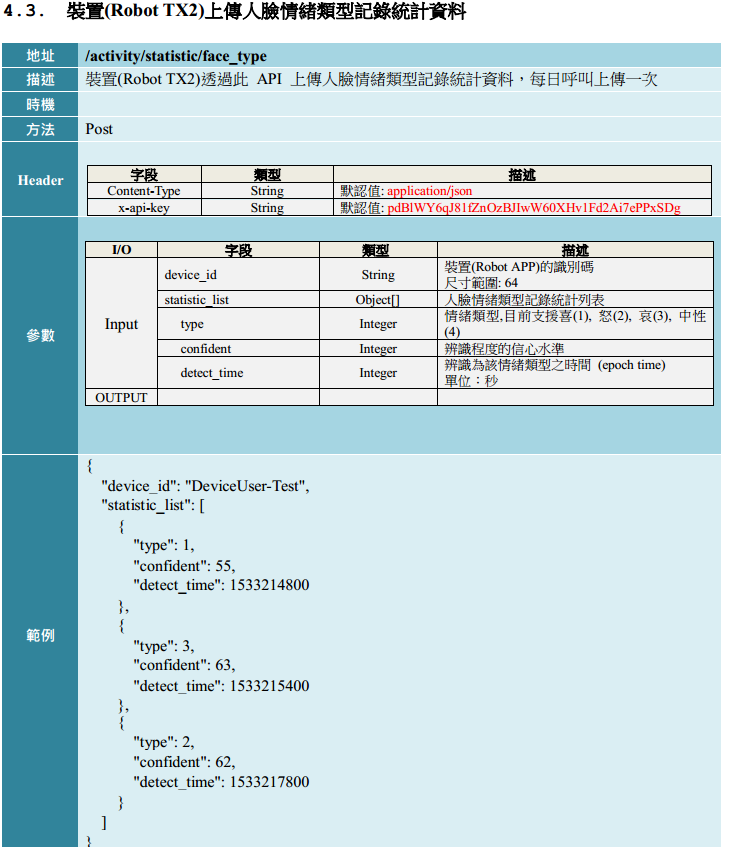

# Emotion recognition
This is the tensorflow slim model for emotion reconition

# Environmental requirements
Opencv 3.2 or laster

Tensorflow 1.4.1

# Training variable
train_image_size=160 

max_number_of_steps=60000 

Pre-trained Models=resnet_v2_50

# Start up
```
python python/main.py
```

# Log
```
cat result.log
```

# Http Server --> Local Server
```
http://127.0.0.1:5000/
```

# Http client request --> Amibo Server
```
example1  : falling report call --> clientFlask1.py

requests.post(urlAddr+"/activity/statistic/fall", data=json.dumps(user_info),headers=headers)
```


```
example1  : day Activity call --> clientFlask1.py

requests.post(urlAddr+"/activity/statistic/day_activity", data=json.dumps(user_info),headers=headers)
```


```
example1  : face emotion call --> clientFlask1.py

requests.post(urlAddr+"/activity/statistic/face_type", data=json.dumps(user_info),headers=headers)
```



# Crontab --> Daily update
```
* daily 23:02 to call client_faceType_emotion.py to upload data to amibo
crontab -e
2 23 * * *  python  /media/nvidia/OS_Install/pyfacV3/client_faceType_emotion.py >> /media/nvidia/OS_Install/pyfacV3/client_faceType_emotion.log 2>&1
```

* modify jsonPath.txt & restart crontab
to specify your json path in this otherwise daily upload function will not upload
```
root@tegra-ubuntu:/media/nvidia/OS_Install/temp1/rosEmotion_detect/src# crontab -e
root@tegra-ubuntu:/media/nvidia/OS_Install/temp1/rosEmotion_detect/src# /etc/init.d/cron -restart

```

# model file download
```
* Downloading model file and put "model.ckpt-60000.data-00000-of-00001" to ./model/inception/  and you can get file as below  hyperLink 
```
https://www.dropbox.com/home?preview=model.ckpt-60000.data-00000-of-00001​ 
# Function Input & Output

See python/main.py

```
#function input
expr_list = r.classify_image(frame, bbox_list)

#function output
#[(2, 0.93376148), (2, 0.98358649), (1, 0.98518467), (2, 0.9335444), (0, 0.7758944)]
print(fexpr_list)
```
